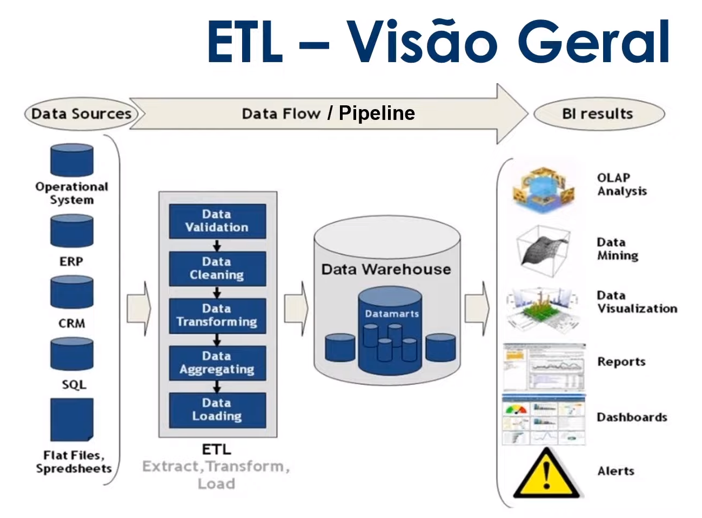

# Introdução ao ETL

 

## 1) Extract

A <b>etapa de extração</b> permite que os dados sejam extraidos de diversas fontes. Esses dados podem ser processados em lotes ou em tempo real. 

  

## 2) Transformation

Como os dados são extraídos de diferentes fontes, é necessário garantir a consistência e integridade destes. Isso é feito na <b>etapa de tranformação</b>. Os dados são propagados para a área de preparação, validados, limpados e transformados.

  

## 3) Load

Na <b>etapa de carregamento</b>, os dados que foram transformados são carregados no data warehouse.

  

# Visão Geral

  

# Ferramentas Python ETL

 

 

 

 

